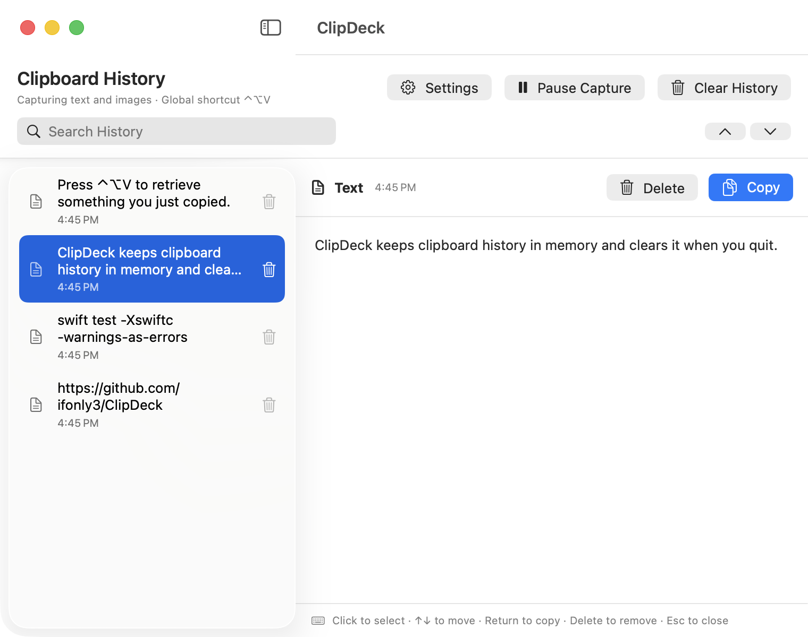
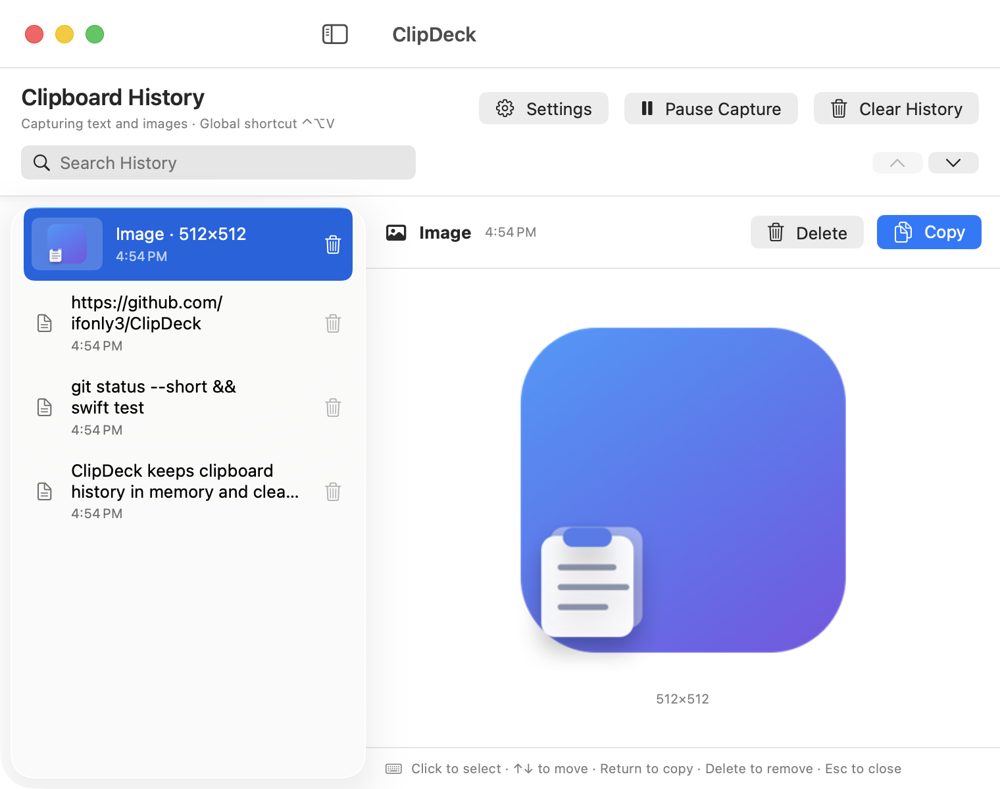
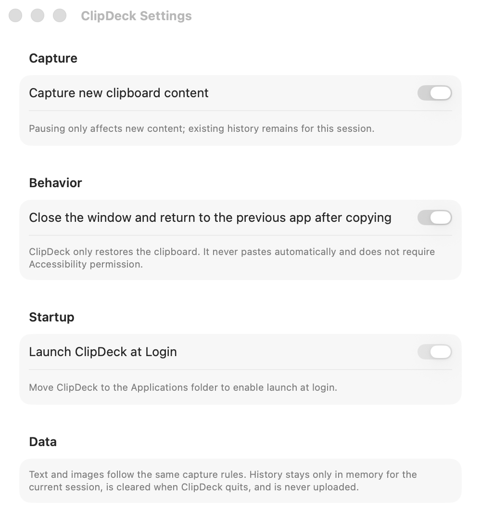

# ClipDeck

<p align="right"><a href="README.md">简体中文</a> · <strong>English</strong></p>

> A native, focused, and fast session-based clipboard history utility for macOS.

  [](https://github.com/ifonly3/ClipDeck/actions/workflows/ci.yml) 

ClipDeck is a **native, focused, and fast** clipboard history utility for macOS. Built with SwiftUI and AppKit, it uses no Electron shell or third-party runtime and stays focused on one job: bringing back the text and images you just copied.

<p align="center">
  
</p>

<p align="center">
  <strong>Copy → ⌃⌥V → Click or ↑ / ↓ → Return</strong><br>
  <sub>Choose items with either the pointer or keyboard, then optionally return to the previous app.</sub>
</p>

## Why ClipDeck

- **Native and lightweight:** SwiftUI + AppKit with negligible idle CPU usage.
- **Text and images:** Supports text plus PNG, JPEG, HEIC, GIF, TIFF, and other image formats recognized by macOS.
- **Pointer and keyboard friendly:** Press `⌃⌥V`, click an item or move with `↑` / `↓`, then press `Return` to copy it.
- **Always available from the menu bar:** Recover recent content without first finding the main window.
- **Session-level privacy:** History stays in memory and is cleared when ClipDeck quits. Nothing is written to disk or uploaded.
- **Predictable controls:** Pause capture, search, delete and undo individual items, confirm before clearing, and return to the previous app after copying.
- **Native launch at login:** Uses the macOS login-item API instead of a persistent LaunchAgent.
- **Bilingual interface:** Supports English and Simplified Chinese and follows the macOS system language automatically.

## Interface

<table>
  <tr>
    <td width="60%" valign="top">
      
      <br><sub><strong>Image history:</strong> preview common image formats and inspect their dimensions before copying.</sub>
    </td>
    <td width="40%" valign="top">
      
      <br><sub><strong>Native settings:</strong> control capture, close-after-copy behavior, and launch at login.</sub>
    </td>
  </tr>
</table>

## Everyday uses

| Scenario | Recently copied content | What ClipDeck helps with |
| --- | --- | --- |
| Development | Commands, errors, code fragments, configuration values | Recover the right snippet without repeatedly switching back to a terminal or document. |
| Writing | Headlines, links, quotes, and draft alternatives | Keep the immediate context around and bring back the previous wording. |
| Image work | Screenshots, icons, and visual references | Preview the image and its dimensions before choosing it. |
| Cross-app work | Research, messages, and spreadsheet values | Copy several things across apps and retrieve each one when needed. |

For example, you might copy a test command, a branch name, and a configuration value in sequence:

```text
swift test -Xswiftc -warnings-as-errors
codex/clipboard-shortcuts
{"environment":"staging","region":"ap-east-1"}
```

Press `⌃⌥V`, click the item or choose it with the arrow keys, then press `Return`—there is no need to find the original source again.

> ClipDeck treats recent clipboard content as short-term memory for the current work session. It is not a password manager, permanent archive, or cross-device sync service.

## Install

### Download the DMG (Apple silicon)

[Download ClipDeck from the English website](https://clipdeck-macos.aild-pricing.workers.dev/en). The current build supports Apple silicon Macs (M series) running macOS 13 or later.

Open the downloaded DMG and drag ClipDeck into Applications. This community build is ad-hoc signed; it is not signed with an Apple Developer ID and has not been notarized by Apple. If macOS blocks the first launch, follow the website instructions, verify the SHA-256 checksum, and use **Open Anyway** only if you trust this project and its source code.

### Build from source

Requires macOS 13 or later plus Xcode Command Line Tools / Swift 6.

```bash
git clone https://github.com/ifonly3/ClipDeck.git
cd ClipDeck
./script/install_release.sh
```

The script builds a Release bundle, generates the application icon, applies an ad-hoc signature, verifies code integrity, installs `/Applications/ClipDeck.app`, and launches it.

## Use

1. Launch ClipDeck and copy text or images as usual.
2. Press `⌃⌥V`, or click the ClipDeck menu bar icon.
3. Search and click an item, or move through history with the arrow keys.
4. Press `Return` to copy the selected content back to the system clipboard.

Main-window shortcuts:

| Action | Shortcut |
| --- | --- |
| Show ClipDeck globally | `⌃⌥V` |
| Search | `⌘F` |
| Select with the pointer | Click any history item |
| Select previous / next | `↑` / `↓` |
| Copy selected content | `Return` |
| Delete selected content | `Delete` |
| Undo deletion | `⌘Z` |
| Close the window | `Esc` or `⌘W` |

Open Settings from the gear button in the main window or from the menu bar menu.

## Privacy and data scope

Clipboard history exists only in the current process memory. Quitting, signing out, shutting down, or restarting clears it. ClipDeck does not serialize history to disk or upload it. Clearing ClipDeck history does not clear the current system clipboard.

ClipDeck does not try to decide whether content is sensitive. Any readable text or image within the safety limits is recorded under the same rules. Ordinary preferences such as window position and close-after-copy behavior are stored with macOS `UserDefaults`; they never contain clipboard text or images.

Default limits:

- Up to 40 history items.
- Up to 50 KB per text item.
- Up to 32 MB and 20 megapixels per image, with a maximum edge of 12,000 pixels.
- Up to 128 MB total image-history memory.

## Performance design

- Observes clipboard changes with a low-frequency timer instead of busy polling.
- Serializes image loading, format detection, hashing, and thumbnail creation in a background actor.
- Preserves compressed source data and caches 320 px previews so list rendering does not repeatedly decode large images.
- Uses a bounded image queue so a burst of large images cannot block later text captures or exhaust memory.
- Caches searchable text, menu titles, and timestamp strings to reduce SwiftUI recomputation and idle wakeups.

## Development

Build and run a Debug app:

```bash
./script/build_and_run.sh
```

Build and test:

```bash
swift build -Xswiftc -warnings-as-errors
swift test -Xswiftc -warnings-as-errors
```

Optional diagnostics:

```bash
./script/build_and_run.sh --verify
./script/build_and_run.sh --debug
./script/build_and_run.sh --logs
./script/build_and_run.sh --telemetry
```

The debug workflow stops any existing ClipDeck instance, builds and verifies a temporary `.app`, then opens it through LaunchServices. The project intentionally prevents multiple instances; do not use `open -n`, which can stack duplicate windows with the same bundle identifier.

## Project structure

```text
Sources/ClipDeck/
├── App/          # SwiftUI scenes and application entry point
├── Models/       # Clipboard content models
├── Services/     # Image processing, hot key, login item, and window coordination
├── Stores/       # Clipboard capture, history, and memory budgets
├── Support/      # Shared helpers and extensions
└── Views/        # Main window, detail, menu bar, and Settings UI

Tests/            # Swift Testing regression tests
script/           # Build, packaging, signing, and installation scripts
```

## Contributing

Issues, feature suggestions, and pull requests are welcome. Before submitting code, run the full test suite and preserve ClipDeck's native, focused, and fast product direction.

## License

ClipDeck is open source under the [MIT License](LICENSE).
